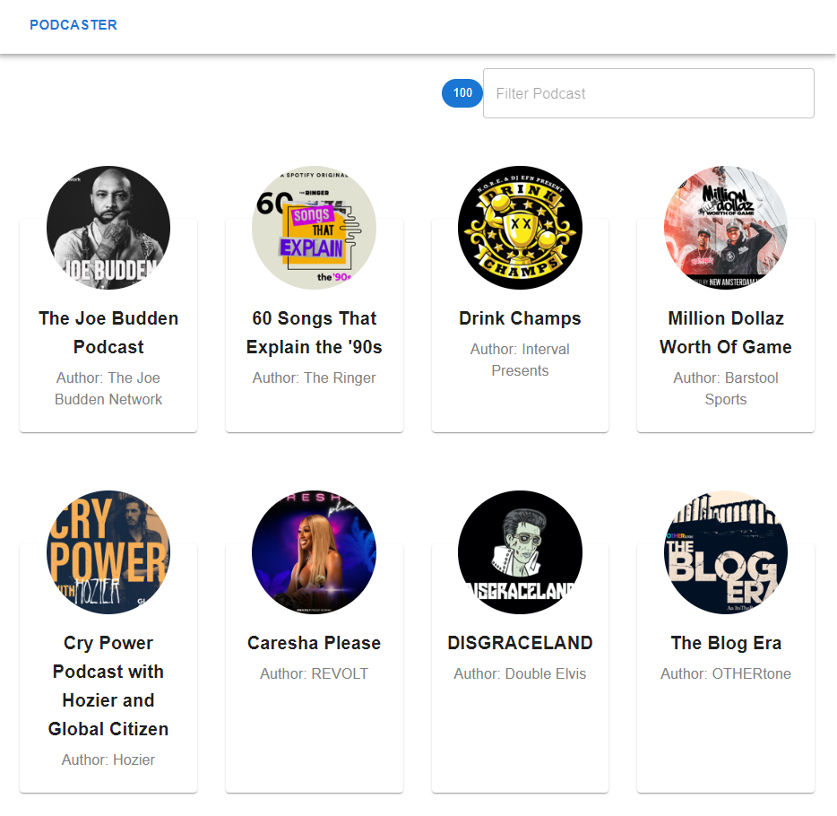
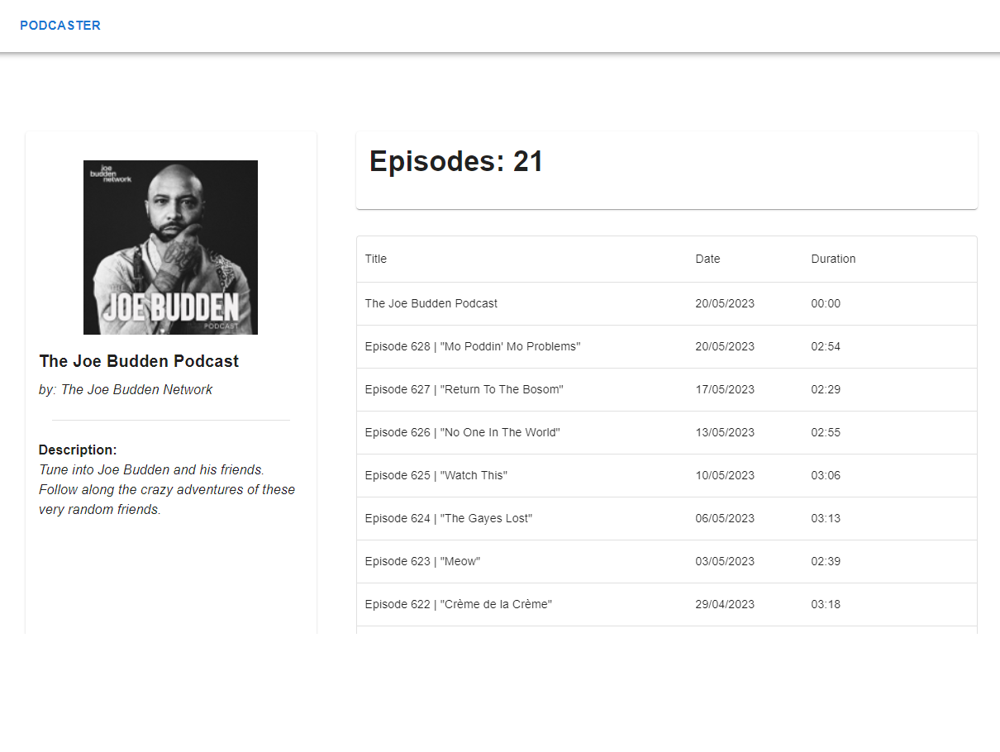
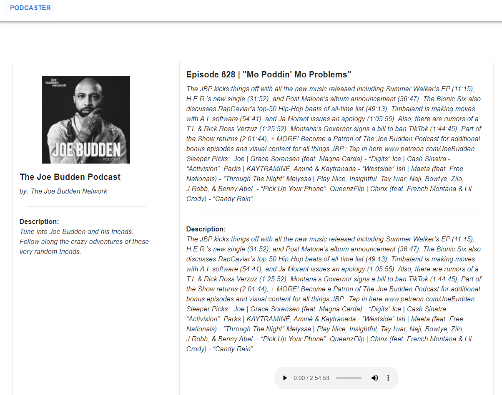

# Listen Podcast 

This application made with React 18 and Material UI Interface allows you to listen to the top 100 podcasts.

## Pages
This project have 3 views.

### Main Page  `URL: /`
You can select podcast o search in the list

### Podcast Episodes List Page `URL: /podcast/{podcastId}`

You can select episode of podcast 

### Episode detail Page `URL: /podcast/{podcastId}/episode/{episodeId}`
You can select episode of podcast 

## Available Scripts

In the project directory, you can run:

### `npm start`

Runs the app in the development mode.\
Open [http://localhost:3000](http://localhost:3000) to view it in your browser.

The page will reload when you make changes.\
You may also see any lint errors in the console.

### `npm run build`

Builds the app for production to the `build` folder.\
It correctly bundles React in production mode and optimizes the build for the best performance.

The build is minified and the filenames include the hashes.\
Your app is ready to be deployed!

See the section about [deployment](https://facebook.github.io/create-react-app/docs/deployment) for more information.

